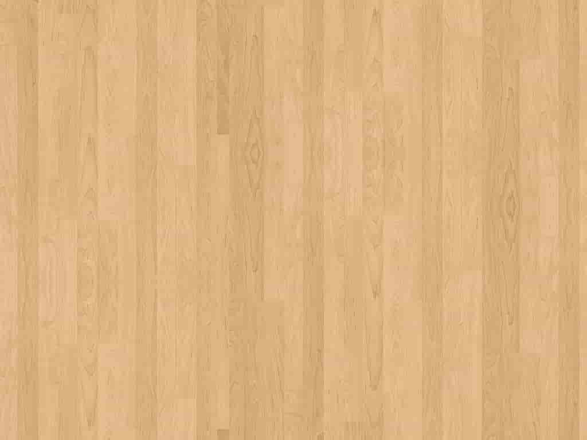

 
 

>## Intro

The application is developed using the Next.js framework by Vercel. 
It is entierly built in Typescript (see [tsconfig.json](./tsconfig.json) for more details) and it is a fully working PWA thanks to the next-pwa library that makes registering a service worker a piece of cake (see [next.config.js](./next.config.js) for more details). 

It manages 3 environments: 
- Test [ NODE_ENV=production ENV=test ] 
- Staging [ NODE_ENV=production ENV=staging ] 
- Production [ NODE_ENV=production ENV=production ] 

The first two environments are deployed on the same server instance while production is being deployed to a standalone server instance and both servers are provided by Hetzner.

 
 

>## Start the project locally

After cloning the repository all we have to do is run a couple of commands to have it up and runninng: 
- yarn | npm i 
- yarn dev | npm run dev 

At this point everything should be up and the site can be visited in dev mode on localhost:3000 

 
 

>## Start a distribution build of the project

To make a distribution build of the project and start that instead of dev mode we have to run 3 commands: 
- yarn | npm i 
- yarn build-<ENV> | npm run build-<ENV> [ e.g: yarn build-test, yarn build-staging, yarn build-production ] 
- yarn start-<ENV> | npm run start-<ENV> [ e.g: yarn start-test, yarn start-staging, yarn start-production ] 

 
 

>## Structure and main libraries

All the source code is located into the "src" directory. Subdirectories are organised as follows:

- [pages](./src/pages) 
This is the main directory, each file represents a route itself aside of underscored pages that are internal to Next.js. 
Each route has its container page located in [pageContainers](./src/pageContainers)

[//]: # (https://www.tablesgenerator.com/markdown_tables was used to create a nice table)

| Route                          	| Type      	| Title                   	| Entry point                                                                         	|
|--------------------------------	|-----------	|-------------------------	|-------------------------------------------------------------------------------------	|
| /auth/login                    	| Public    	| Login                   	| [login](./src/pageContainers/auth/login/index.tsx)     |
| /                              	| Protected 	| Dashboard               	| [dashboard](./src/pageContainers/dashboard/index.tsx)  |

 

- [assets](./src/assets) 
Custom icons can be found here, usually custom svg icons are interpolated between Material UI SvgIcon tags.

 

- [components](./src/components) 
Here we have various kind of components, both simpler and more complex ones. Almost all of the components are "app-indipendent" meaning that they are generic enough to be used elsewhere. 
*NOTE: here we have 2 components that are the beating heart of the whole application. They act like a simpler abstraction for the system to work. These components are: 
 - [_ZenApp](./src/components/_ZenApp/index.tsx) => main component 
 - [_ZenMenu](./src/components/_ZenMenu_/index.tsx) => includes desktop and mobile menu for the app, links in the menu strongly rely on the [routes.ts](./src/utils/routes/index.ts)
Honorable mentions: 
 - [FormikInput](./src/components/FormikInput/index.tsx) => input component that uses the Formik library under the hood and takes care of any input type needed managing their value and the errors 
 - [ZenTable](./src/components/ZenTable/index.tsx) => table component that takes care of displaying a nice table given a set of data, it consists of a full table on desktop and an accordion-type table on mobile 
 - [Filters](./src/components/Filters/index.tsx) => component that takes care of showing and managing eventual filters (in a side drawer) and search inputs. Often used concurrently with the table component

 

- [MUITheme](./src/MUITheme/index.tsx) 
Here is where the Material UI themes are located, it includes 2 themes: "dark" and "light" as well as a palette that is independent from the themes and it serves as an actual color palette often used on custom styling.

 

- [SDK](./src/SDK/index.ts) 
This is an SDK made specifically for this project. 
It provides an easy way to interact with the apis and it's organised into modules. It uses [axios](https://www.npmjs.com/package/axios) as HTTP-client and the setup can be found here [ZenAxios](./src/SDK/helpers/ZenAxios.ts). 
This kit is splitted into modules so it is easier to maintain and manage eventual new apis. 
Every module corresponds to a section of the application and they can be found in the [Modules](./src/SDK/Modules) folder.

 

- [swr](./src/swr) 
This directory provides hooks for data-fetching and caching that are used across the whole app. 
It relies on the [swr](https://www.npmjs.com/package/swr) library as these are custom hooks that are in fact wrappers of the vercel swr library and the folder structure almost completely resembles the [SDK/Modules](./src/SDK/Modules) one. 
For each subdirectory we have an "index.ts" file that contains the actual exported hooks and a "fetchers.ts" file that exports fetchers used by swr. 
Fetchers per-se are just plain functions that take as first argument a key (used by swr for caching) and other optional arguments. 
This order is just a convention as it is the fact that all the arguments are strings.

 

- [zustand](./src/zustand) 
This directory contains as many directories as stores. A store is a centralized object that acts as a data-center. Stores can contain data and provide functions to interact with it. 
These stores rely on the [zustand](https://www.npmjs.com/package/zustand) library. 
This application provides 2 stores: 
 - [config](./src/zustand/config/index.ts) => containing main config data such as open/close snackbar, active theme and switch theme toggle, route tracking, menu toggle, and so on. 
 - [export](./src/zustand/export/index.ts) => that provides export actions and takes care of retrieving the file from firebase and compiling the csv. 
It keeps track of every export made but percistency is not guaranteed leading to state reset on page reload.

 

- [utils](./src/utils) 
TODO

